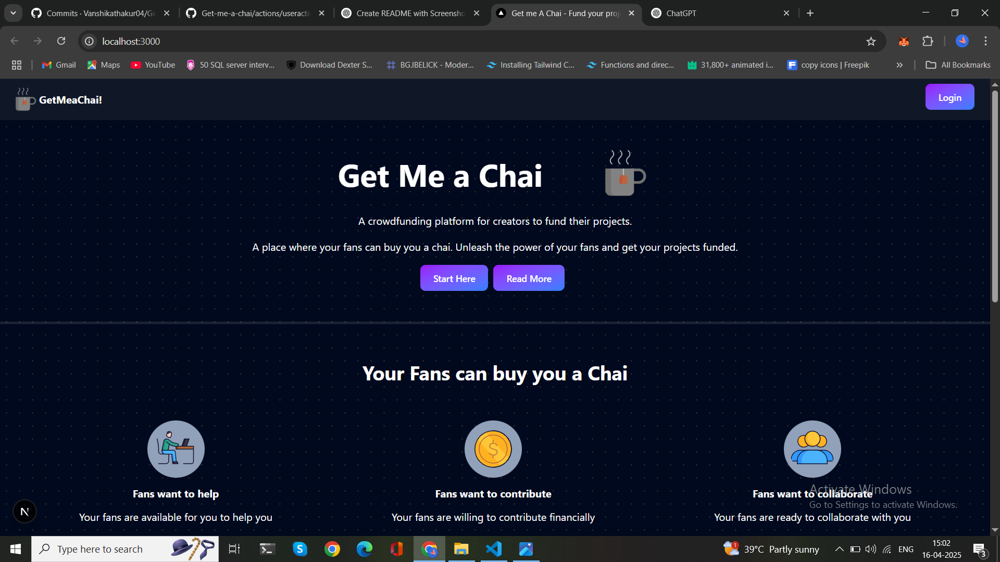

# Proejct Name: Get-me-a-chai

# Description: "Get Me a Chai" is crowdfunding platform designed for creators, developers, and freelancers to receive support from their fans. Whether you're building a passion project or working on something impactful, this platform allows your audience to appreciate your work by buying you a virtual chai. It's a simple and effective way to get funded and stay motivated through your creative journey.

## Features

### Allow fans to buy virtual chai and support creators
### Personalized user dashboards and public profiles
### Secure login and authentication system

## Screenshots

### Homepage

.png)

### Login Page

### Dashboard Page

.png)

### User Page

.png)
.png)
.png)
.png)

### About Page

.png)

## Tech Stack

### Frontend: Next.js
### Backend: MongoDB
### Styling: Tailwind.CSS

